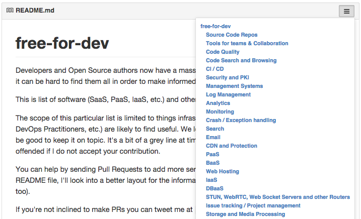
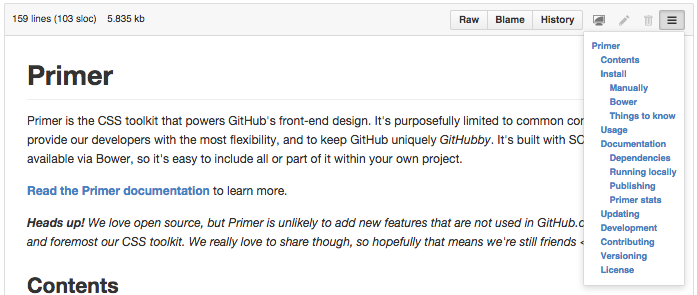

# Markdown Menu for GitHub

> Browser extension that adds a navigation menu to any readme or Markdown file on GitHub.

GitHub readmes and Markdown documents don't always include a table of contents. Well-documented repos have longer documents that can be difficult to navigate. This extension will automagically generate and add navigation menu with a table of contents.

Click on the three-bar icon at the top of any Markdown file to view the menu. Click on a link to scroll to that section of the document. That's it!

README example:

Markdown view example:

## Install

[Chrome WebStore](https://chrome.google.com/webstore/detail/github-markdown-menu/jekgocfoijmbgcjejohdgmojaejofdpo)

### For Developers

You can also setup the dev version:

- from the CLI: git clone https://github.com/willklein/markdown-menu.git
- open the extensions page: chrome://extensions
- enable Developer mode
- click Load unpacked extension, selecting the chrome/app directory

## Supported Browsers

Current:
- Chrome

Planned:
- Firefox
- Safari
- Opera

I have experience developing Chrome extensions, so that was easiest to start with. I plan to add support for Firefox and then Safari and Opera.

## Help, Issues and Support

Ask questions, post issues, and share suggestions using [Waffle](https://waffle.io/willklein/markdown-menu). Waffle is a kanban board backed by GitHub Issues. You can also tweet me [@WillsLab](https://twitter.com/willslab).

## Permissions

In Chrome, this extension requests the following permissions:
- Read and change your data on github.com
> This extension is scoped and enabled only when accessing https://github.com/\*. This extension looks for Markdown headers, generates a navigation menu and adds it to Markdown views on GitHub.

- Read your browsing history
> For this extension to work across page navigations within github.com, permissions are necessary to use chrome.webNavigation.onHistoryStateUpdated. This lets the extension hook into page navigations and trigger without full page refreshes.

### More on Permissions

Over the years I've found that certain Chrome APIs required more permissions over time. I've also seen a lot of negative reviews for Chrome extensions wondering why more permissions are being requested. This is understandable; it certainly seems intrusive to ask for more permissions.

I've listed the specific reasons for each permission to explain why they are needed. Between that, and the full source code made available under the [MIT license](http://mit-license.org/), I hope that alleviates any concerns.

## Contribute

On-going development & open issues are tracked using Waffle: 

Let me know what you're hacking [@WillsLab](https://twitter.com/willslab). I'll happily work with you to make your efforts successful!

### Guidelines

- in the chrome directory, run npm install
- run grunt debug to run tests
- setup [EditorConfig](http://editorconfig.org/) in your preferred editor to maintain file consistency
- make sure there are no JSHint warnings or errors

### Dependencies

The Chrome extension was generated using [Yeoman](http://yeoman.io) and the [Chrome Extension generator](https://github.com/yeoman/generator-chrome-extension). [Grunt](http://gruntjs.com/) is used for building and packaging the extension. There are no runtime dependencies.

## About

I work with several well-documented repos, with 500+ line READMEs. I'm thankful for the documentation, but it's hard to parse and find what I'm looking for. I built Markdown Menu to scratch this itch; I hope it might help others too.

## License

[MIT](http://mit-license.org/) © [Will Klein](http://willklein.co)
